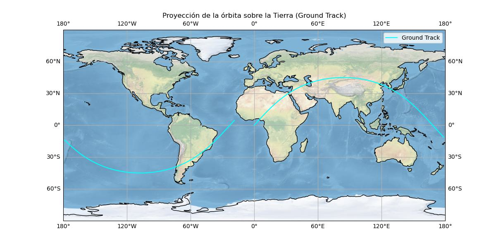

# SIM-ORBIT

This project simulates a satellite orbit around Earth using Keplerian elements. It numerically integrates the trajectory in ECI coordinates and converts it to latitude and longitude to visualize the ground track on a global map using Matplotlib and Cartopy.

## Features

- Keplerian to Cartesian conversion
- Orbital integration with `solve_ivp`
- Ground track generation with Cartopy
- Simple, readable Python code

  

  <p align="center">
  
</p>

## How to run

1. Install dependencies:
   ```bash
   pip install numpy scipy matplotlib cartopy

   


